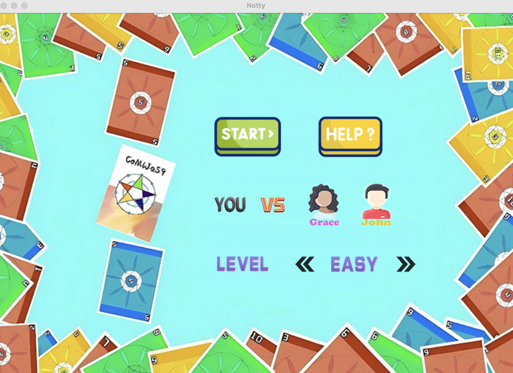
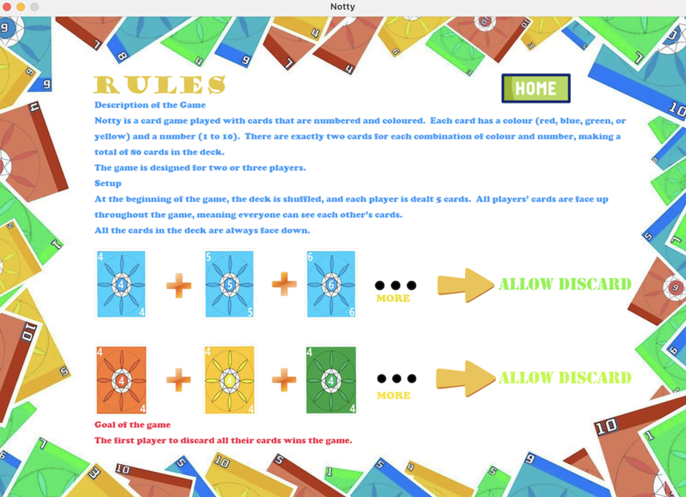
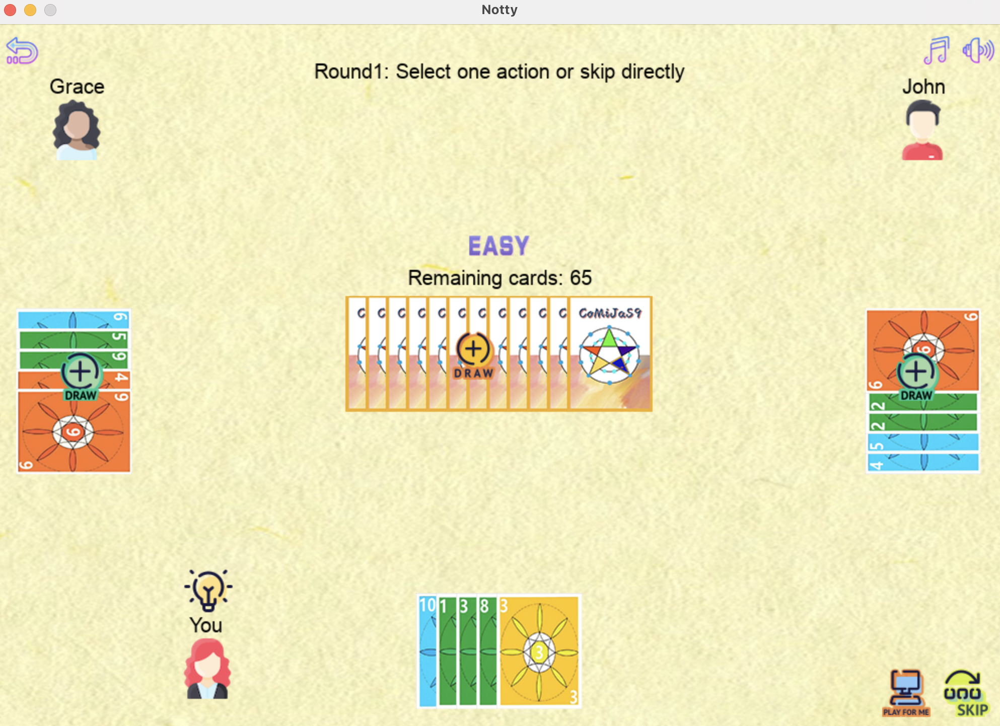
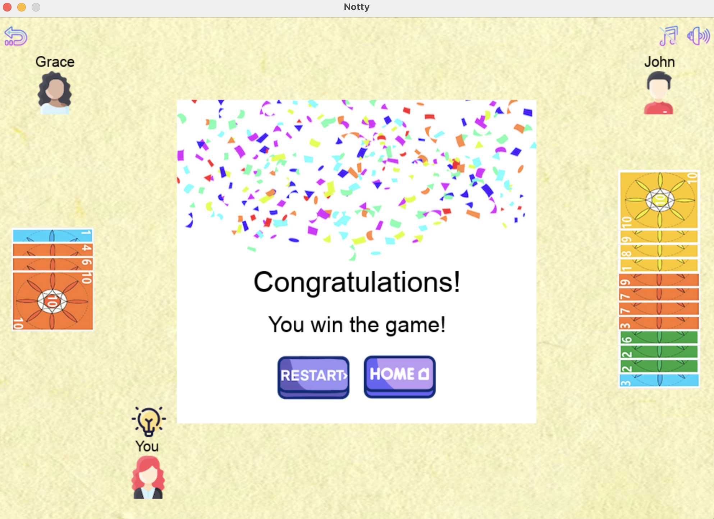

# Notty - A Pygame-Based Card Game  

## Game Overview  
**Notty** is a lightweight card game developed using Pygame, supporting one human player competing against one or two AI players.  
In the game, players aim to empty their hands by drawing cards from the deck, stealing cards from other players, and discarding cards strategically to win the match.  

### Key Features  
- **Custom UI**: A visually appealing and user-friendly interface designed by the team.  
- **Multi-level AI**: Three difficulty levels for AI opponents to test your strategic thinking:  
  - **Easy Mode**: A victory assistance mechanism is included, ensuring that human players always draw or steal cards that can form valid sets.
  - **Medium Mode**: AI players choose the best actions based on probability analysis.  
  - **Hard Mode**: AI players adopt disruptive strategies, increasing the challenge.  
- **Global Transparency**: All players’ hands are visible throughout the game, emphasizing strategic planning.  
- **Randomness and Rebalancing**: The deck is reshuffled after each discard, adding unpredictability.  

---

## Game Rules  

### Card Composition  
- **Colors**: Red, Blue, Green, and Yellow.  
- **Numbers**: From 1 to 10.  
- Each color-number combination has two cards, making a total of 80 cards.  

### Game Start  
- Shuffle the deck and deal 5 cards to each player.  
- All players’ hands are displayed face-up at all times.  

### Gameplay  
- Players take turns performing the following actions (each with specific limits per turn):  
  1. **Draw Cards**: Draw 1 to 3 cards from the deck (once per turn).  
  2. **Steal Cards**: Randomly steal one card from another player (once per turn).  
  3. **Discard Cards**: Discard valid sets (no limit):  
     - **Same-Color Sequences**: At least three consecutive numbers of the same color.  
     - **Same-Number Sets**: At least three cards of the same number but different colors (no duplicates).  
- **Hand Limit**: A maximum of 20 cards is allowed. If exceeded, player actions are restricted.  

### Winning Condition  
The first player to empty their hand wins.  

---

## Installation and Execution  

### System Requirements  
- Python 3.9 or higher  
- Pygame library  

### Installation Steps  
1. Clone the repository:  
   ```bash
   git clone https://github.com/yucathy/notty_game_project.git
   cd notty_game_project

2. Install dependencies:
    ```bash
    pip install -r requirements.txt
3. Run the game:
    ```bash
   python main.py

### Project Structure
    notty_game_project/
    │
    ├── card.py                # Defines the Card class
    ├── deck.py                # Defines the Deck class
    ├── components.py          # Helper components
    ├── functions.py           # Game-related utility functions
    ├── players.py             # Defines Actions, ComputerPlayer1, and ComputerPlayer2 classes
    ├── notty_game.py          # Main game logic
    ├── gui.py                 # GUI design and event management
    ├── main.py                # Entry point of the program
    ├── images/                # Game image assets
    ├── sounds/                # Game music/sound assets
    ├── testCaseDoc/           # Test cases and issue documentation (pending updates)
    ├── NottyGame Specification # Project specifications (pending updates)
    ├── requirements.txt       # Project dependencies
    └── README.md              # Project documentation

---

## Team Collaboration and Acknowledgments

### Team Members  
- **Mingxin Cao** - Backend logic development, coordination, and support
- **Xinyu Liu** - Code and feature testing
- **Tzu Chun Yu** - Backend logic development, Final code acceptance person
- **Siwen Zhao** - frontend GUI development, UI and frontend interaction design
- **Xiuyuan Tao** - UI and frontend interaction design

### Project Timeline  
| Date          | Milestone                               |  
|---------------|-----------------------------------------|  
| 11/04-11/21   | Software setup and feature development  |  
| 11/22-11/24   | Issue fixing and knowledge enhancement  |  
| 11/25         | Initial feature integration and testing |  
| 11/26-11/29   | Issue resolution and feature refinement |  
| 11/30-12/02   | Feature validation and final checks     |  
| 12/03-12/06   | Documentation and project submission    |  

### Special Thanks  
A heartfelt thank you to all team members for their hard work and to the Pygame open-source project for providing a robust framework for game development.

---

## Game Preview  






